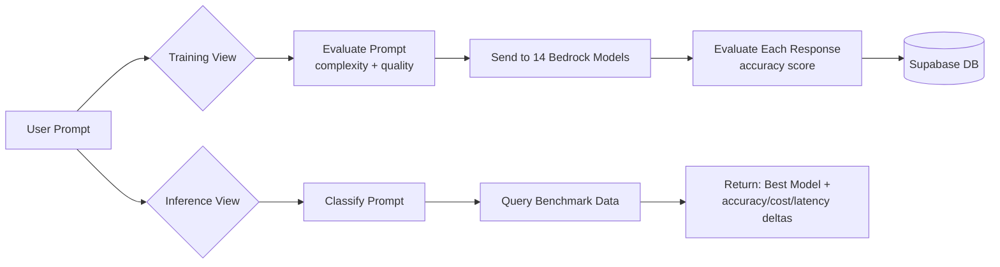

# LLM Recommendation System — Docs Analysis

## What We're Building

A two-part web application that **benchmarks LLMs** and **recommends the best one** for a given prompt.



---

## Architecture Overview

### Tech Stack

| Layer | Technology |
|---|---|
| Backend | **Python FastAPI** |
| Database | **Supabase** (PostgreSQL) |
| LLM Providers | **AWS Bedrock** (9 models) |
| Evaluator Models | Gemini 2.0 Flash / GPT-4o / Claude Sonnet 4.6 |
| Real-time | **SSE** (Server-Sent Events) |
| Frontend | React + Vite (separate, later) |

---

## Backend Structure

```
backend/
  main.py                    ← FastAPI app entry, CORS, router mounting
  routers/
    training.py              ← POST /run, POST /upload, GET /stream/{job_id}
    inference.py             ← POST /recommend
  services/
    evaluator.py             ← Gemini/GPT/Claude prompt & response evaluation
    bedrock.py               ← Parallel calls to all 9 Bedrock models
    supabase_client.py       ← DB read/write
    recommender.py           ← Weighted scoring recommendation engine
  models/
    schemas.py               ← Pydantic request/response models
  jobs/
    store.py                 ← In-memory asyncio.Queue per job for SSE
  .env
  requirements.txt
```

---

## API Endpoints

| Method | Endpoint | Description |
|---|---|---|
| `GET` | `/health` | Health check |
| `POST` | `/api/training/run` | Start single-prompt training job → returns `{ job_id }` |
| `POST` | `/api/training/upload` | Start CSV training job → returns `{ job_id }` |
| `GET` | `/api/training/stream/{job_id}` | SSE stream of progress/done/error events |
| `POST` | `/api/inference/recommend` | Get model recommendation → returns full recommendation object |

---

## Core Training Flow (per prompt)

1. **Evaluate the prompt** via evaluator model → `{ prompt_complexity, prompt_quality_score }`
2. **Enrich the prompt** by appending complexity + quality metadata
3. **Send enriched prompt to all 9 Bedrock models** in parallel (via `ThreadPoolExecutor`)
4. **Evaluate each model's response** → `{ accuracy_score }`
5. **Save each row to Supabase** (1 row per model per prompt)
6. **Push SSE event** to frontend for live updates

---

## Bedrock Models (9 total)

| Provider | Model IDs |
|---|---|
| Amazon | `amazon.nova-lite-v1:0`, `amazon.nova-pro-v1:0` |
| Meta | `meta.llama3-3-70b-instruct-v1:0`, `meta.llama4-scout-17b-16e-instruct-v1:0` |
| Mistral AI | `mistral.mistral-large-2402-v1:0`, `mistral.mistral-small-2402-v1:0`, `us.mistral.pixtral-large-2502-v1:0` |
| DeepSeek | `deepseek-ai/deepseek-r1-0528-maas`, `deepseek-ai/deepseek-v3.2-maas` |

---

## Recommendation Engine (v1)

- Pulls benchmark rows from Supabase filtered by `use_case` + `complexity`
- Aggregates per-model: avg accuracy, avg cost, avg latency
- Applies **weighted composite score**: `0.6 × accuracy + 0.3 × cost_inv + 0.1 × latency_inv`
- Min-max normalization across all models
- Returns deltas (accuracy %, cost %, latency ms) vs. user's current model

---

## Database Schema (`benchmark_results`)

| Column | Type | Description |
|---|---|---|
| `id` | uuid | Auto PK |
| `created_at` | timestamp | Auto |
| `provider` | text | e.g. Amazon, Meta |
| `model_id` | text | e.g. `amazon.nova-pro-v1:0` |
| `prompt` | text | Original prompt |
| `prompt_complexity` | text | low / mid / high |
| `prompt_quality_score` | integer | 0-100 |
| `response` | text | Raw model response |
| `accuracy_score` | integer | 0-100 |
| `cost` | float | USD cost |
| `tokens` | integer | Total tokens |
| `latency_ms` | integer | Response time in ms |

---

## Key Design Decisions

| Decision | Rationale |
|---|---|
| **SSE for training** | 14 models × N prompts takes time; live streaming gives instant feedback |
| **User-selected use case** | Classifying use case from prompt alone is error-prone |
| **Temperature=0 evaluator** | Reduces scoring variance; grouped bands (90-100, 70-89, etc.) anchor scores |
| **Store response text** | Enables auditing evaluator scores; can drop later for ML training |
| **BackgroundTasks + asyncio.Queue** | Training runs in background; SSE consumes from queue |

---

## Environment Variables Needed

```
SUPABASE_URL, SUPABASE_KEY
AWS_ACCESS_KEY_ID, AWS_SECRET_ACCESS_KEY, AWS_REGION
GOOGLE_API_KEY, OPENAI_API_KEY, ANTHROPIC_API_KEY
```

---

## Build Order (from spec)

1. ✅ Set up Supabase table
2. **Build FastAPI skeleton with all endpoints returning mock data** ← **START HERE**
3. Build frontend against mock endpoints
4. Wire in real Bedrock + evaluator calls
5. Test end-to-end with single prompt
6. Test with CSV upload

> [!IMPORTANT]
> The spec recommends starting with **mock endpoints** first, then wiring real services. This is the approach we should follow.
