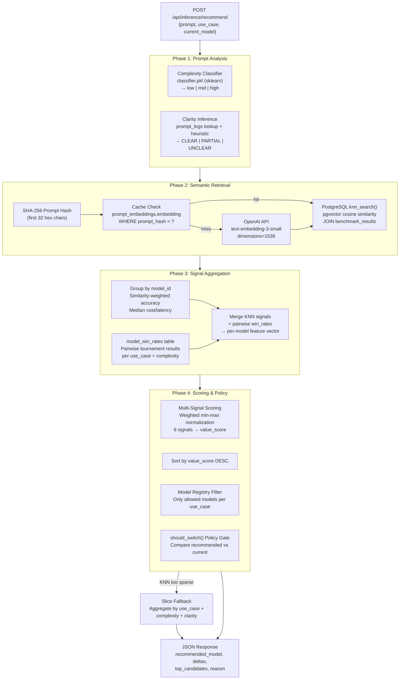
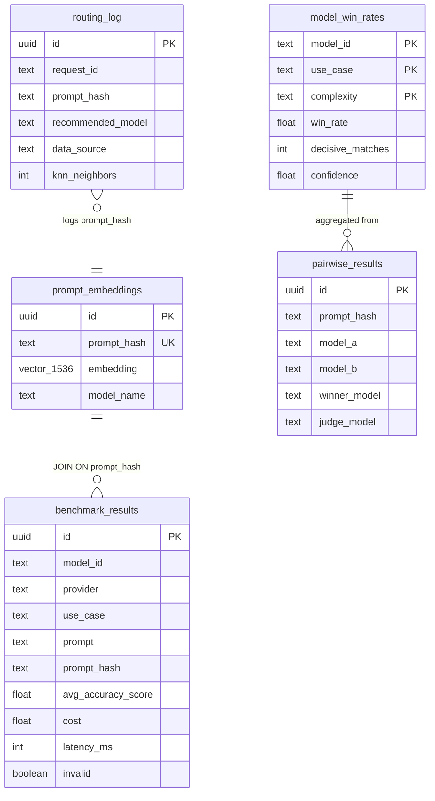

# KNN-Based LLM Recommendation Engine — Technical Deep Dive

> Audience: Senior Engineer / Capstone Reviewer  
> Codebase: `backend/services/recommender.py`, `knn_search.py`, `embedding_service.py`

---

## System Architecture



---

## Phase 1: Prompt Analysis

### 1.1 Entry Point

[inference.py:L118-L128](file:///c:/Users/Musharraf/Documents/POC/backend/routers/inference.py#L118-L128)

```python
POST /api/inference/recommend
Body: { prompt, use_case, current_model, min_accuracy_gain?, max_cost_increase_pct?, max_latency_increase_pct? }
```

The request hits [get_recommendation()](file:///c:/Users/Musharraf/Documents/POC/backend/services/recommender.py#L870-L913) which is the top-level orchestrator. It runs Phase 1 (analysis), then tries KNN. If KNN fails for any reason, it falls back to slice-based recommendation.

### 1.2 Complexity Classification

[infer_complexity()](file:///c:/Users/Musharraf/Documents/POC/backend/services/recommender.py#L121-L168)

```
Input:  "Write a recursive descent parser for arithmetic expressions"
        use_case = "code-generation"

Strategy:
  1. Try sklearn classifier (classifier.pkl) → predict("use_case: code-generation\nprompt: ...")
     → Returns: "high", confidence=0.87, source="classifier"
  
  2. Fallback: keyword heuristic
     → Contains "distributed"/"byzantine"/"architecture" → "high"
     → word_count <= 10, no complex keywords → "low"
     → Otherwise → "mid"

Output: ("high", 0.87, "classifier")
```

### 1.3 Clarity Inference

[infer_clarity()](file:///c:/Users/Musharraf/Documents/POC/backend/services/recommender.py#L171-L240)

```
Strategy:
  1. Exact match in Supabase prompt_logs → majority vote on historical clarity
  2. Exact match in local prompt_logs_rows.csv
  3. Heuristic fallback:
     - word_count <= 3 → UNCLEAR
     - Contains "make it better"/"fix this"/"whatever" → UNCLEAR
     - Contains explicit verbs ("write","implement","explain") → CLEAR
     - Otherwise → PARTIAL

Output: ("CLEAR", "heuristic")
```

> [!NOTE]
> Complexity and clarity are used for: (1) selecting the win_rate slice from `model_win_rates`, (2) filtering benchmark rows in the slice fallback path, and (3) metadata in the response/routing_log.

---

## Phase 2: Semantic Retrieval (KNN)

### 2.1 Prompt Embedding

[get_or_compute_embedding()](file:///c:/Users/Musharraf/Documents/POC/backend/services/embedding_service.py#L103-L145)

```
Input: "Write a recursive descent parser for arithmetic expressions"

Step 1: Hash
  normalized = "write a recursive descent parser for arithmetic expressions"
  prompt_hash = SHA-256(normalized)[:32] = "a7f3c2d1e..."

Step 2: Cache Lookup
  SELECT embedding FROM prompt_embeddings WHERE prompt_hash = 'a7f3c2d1e...'
  → Cache HIT: return stored 1536-dim vector (no API call)
  → Cache MISS: continue to Step 3

Step 3: OpenAI API Call
  POST https://api.openai.com/v1/embeddings
  { model: "text-embedding-3-small", input: <prompt>, dimensions: 1536 }
  → Returns: [0.0123, -0.0456, 0.0789, ...] (1536 floats)

Step 4: Cache Write
  UPSERT prompt_embeddings SET embedding = <vector> WHERE prompt_hash = 'a7f3c2d1e...'

Output: (vector[1536], "a7f3c2d1e...", was_cached=True/False)
```

**Cost**: ~$0.02 per 1M tokens. Typical prompt = ~50 tokens → $0.000001 per call. Cache hits are free.

### 2.2 Vector Similarity Search (PostgreSQL pgvector)

[search_neighbors()](file:///c:/Users/Musharraf/Documents/POC/backend/services/knn_search.py#L18-L37) → calls [knn_search() SQL](file:///c:/Users/Musharraf/Documents/POC/model_training/fix_knn_search.sql)

```sql
-- The SQL function executed via Supabase RPC
SELECT
    br.id, br.model_id, br.provider,
    br.avg_accuracy_score, br.cost, br.latency_ms,
    1 - (pe.embedding <=> query_embedding) AS similarity  -- cosine similarity
FROM prompt_embeddings pe
JOIN benchmark_results br ON pe.prompt_hash = br.prompt_hash
WHERE br.use_case = target_use_case
  AND br.avg_accuracy_score IS NOT NULL
  AND COALESCE(br.invalid, FALSE) = FALSE
  AND 1 - (pe.embedding <=> query_embedding) >= min_similarity
ORDER BY pe.embedding <=> query_embedding  -- ascending distance = descending similarity
LIMIT result_limit;
```

**How pgvector works under the hood**:
- `<=>` is the cosine distance operator: `1 - cos(a, b)`
- HNSW index (`idx_pe_embedding_hnsw`) provides approximate nearest neighbor search in O(log n) instead of O(n)
- Index params: `m=16` (connections per node), `ef_construction=64` (build quality)

### 2.3 Progressive Search Widening

[build_knn_recommendation()](file:///c:/Users/Musharraf/Documents/POC/backend/services/recommender.py#L916-L966)

The search widens progressively if initial results are too sparse:

```
Round 1: k=50,  min_similarity=0.25  → Found 30 neighbors? Continue.
Round 2: k=100, min_similarity=0.15  → Fallback if Round 1 < 5 neighbors
Round 3: k=240, min_similarity=0.00  → Last resort: grab everything
```

```python
neighbors = search_neighbors(supabase, vector, use_case)        # k=50, sim≥0.25
if len(neighbors) < MIN_KNN_NEIGHBORS:                          # MIN=5
    neighbors = search_neighbors(..., k=100, min_similarity=0.15)
if len(neighbors) < MIN_KNN_NEIGHBORS:
    neighbors = search_neighbors(..., k=240, min_similarity=0.0) # grab all
```

If after all 3 rounds there are still no usable signals, the system falls back to **slice-based recommendation** (Phase 6).

---

## Phase 3: Signal Aggregation

### 3.1 Group Neighbors by Model

[aggregate_knn_signals_v2()](file:///c:/Users/Musharraf/Documents/POC/backend/services/recommender.py#L436-L525)

KNN returns raw rows like:

| row_id | model_id | similarity | avg_accuracy_score | cost | latency_ms |
|---|---|---|---|---|---|
| abc1 | nova-pro | 0.34 | 92 | 0.001 | 5800 |
| abc2 | nova-pro | 0.31 | 88 | 0.001 | 6200 |
| abc3 | llama3-3-70b | 0.33 | 95 | 0.0006 | 4100 |
| abc4 | ministral-3-8b | 0.29 | 90 | 0.0001 | 2000 |

These are grouped by `model_id` and aggregated into per-model signals:

```python
for model_id, rows in grouped.items():
    if len(rows) < MIN_MODEL_NEIGHBORS:  # MIN=2
        continue  # skip models with too few data points

    # Similarity-weighted accuracy (core KNN signal)
    sim_weighted_accuracy = Σ(similarity_i × accuracy_i) / Σ(similarity_i)
    
    # Median cost and latency (robust to outliers)
    p50_cost    = median([row.cost for row in rows])
    p50_latency = median([row.latency_ms for row in rows])
    
    # Optional quality flags
    syntax_pass_rate  = mean([1 if syntax_pass else 0 ...])   # code-gen only
    correctness_rate  = mean([1 if is_correct else 0 ...])    # reasoning only
```

### 3.2 Pairwise Win Rates Injection

[get_model_win_rates()](file:///c:/Users/Musharraf/Documents/POC/backend/services/supabase_client.py#L98-L143)

```sql
SELECT model_id, win_rate, decisive_matches, confidence, tie_rate
FROM model_win_rates
WHERE use_case = 'code-generation'
  AND complexity = 'mid'           -- try specific complexity first
  AND win_rate IS NOT NULL
  AND decisive_matches >= 5;       -- minimum statistical support
```

If no results for specific complexity, falls back to `complexity = 'all'`.

Win rates come from pairwise evaluation tournaments stored in `pairwise_results`:
- Two models answer the same prompt
- A judge model picks the winner
- Win rates are aggregated across all matchups

### 3.3 Confidence Signal

```python
confidence_signal = avg_similarity × sample_factor × pairwise_confidence

# Where:
#   avg_similarity     = mean cosine similarity of this model's neighbors
#   sample_factor      = min(num_neighbors / 5, 1.0)  — penalizes sparse data
#   pairwise_confidence = confidence from model_win_rates (0-1)
#                         or 0.35 fallback if no pairwise data exists
```

### 3.4 Model Registry Filter

[get_model_ids_for_use_case()](file:///c:/Users/Musharraf/Documents/POC/backend/services/model_registry.py#L163-L165)

Only models registered for the use case pass through:

```python
CODE_GENERATION_MODELS = {
    "devstral-2", "llama4-maverick", "llama3-3-70b", "nova-pro",
    "nova-premier", "pixtral-large-2", "mistral-large", "magistral-small",
    "deepseek-r1", "ministral-3-8b",
}
```

Models not in this set (e.g., Gemini models, or `llama3-2-90b` for code-gen) are **silently dropped** before scoring.

---

## Phase 4: Multi-Signal Scoring

### 4.1 Scoring Weights

[SCORE_WEIGHTS](file:///c:/Users/Musharraf/Documents/POC/backend/services/recommender.py#L31-L78)

| Signal | code-gen | reasoning | text-gen | Description |
|---|---|---|---|---|
| `win_rate` | 0.25 | 0.25 | 0.25 | Global pairwise tournament performance |
| `knn_accuracy` | 0.25 | 0.25 | 0.25 | **Prompt-specific** similarity-weighted accuracy from KNN |
| `cost` | 0.20 | 0.15 | 0.20 | Lower is better (normalized) |
| `latency` | 0.15 | 0.15 | 0.20 | Lower is better (normalized) |
| `syntax_rate` | 0.10 | — | — | Code syntax pass rate |
| `correctness` | — | 0.15 | — | Reasoning correctness rate |
| `confidence` | 0.05 | 0.05 | 0.10 | Data quality / reliability signal |

### 4.2 Normalization

[score_and_rank_knn_candidates()](file:///c:/Users/Musharraf/Documents/POC/backend/services/recommender.py#L528-L619)

All signals are normalized to [0, 1] using **min-max normalization** across the candidate set:

```python
# Higher is better (win_rate, accuracy, syntax, correctness, confidence)
normalize_higher_better(value, min, max) = (value - min) / (max - min)

# Lower is better (cost, latency)
normalize_lower_better(value, min, max) = 1.0 - (value - min) / (max - min)

# Edge case: if min == max → returns 1.0 (all candidates equal on this signal)
```

### 4.3 Final Score Calculation

```
value_score = Σ(weight_i × normalized_signal_i)
```

**Concrete example** (reasoning use case, 3 candidates):

```
                    win_rate  knn_acc  cost   latency  correct  conf   → value_score
                    (0.25)    (0.25)   (0.15) (0.15)   (0.15)   (0.05)
─────────────────────────────────────────────────────────────────────────
nova-pro            0.643     86.0    $0.001   5831ms   N/A      0.20
  normalized:       1.000     0.000   0.850    1.000    0.500    1.000
  weighted:         0.250   + 0.000 + 0.128  + 0.150 + 0.075 + 0.050  = 0.653

llama4-maverick     0.443     91.5    $0.0004  5844ms   N/A      0.20
  normalized:       0.000     1.000   1.000    0.986    0.500    1.000
  weighted:         0.000   + 0.250 + 0.150  + 0.148 + 0.075 + 0.050  = 0.673 ← WINS

nova-premier        0.627     93.0    $0.006   8427ms   N/A      0.20
  normalized:       0.919     0.818   0.000    0.000    0.500    1.000
  weighted:         0.230   + 0.205 + 0.000  + 0.000 + 0.075 + 0.050  = 0.559
```

**Key insight**: With the rebalanced weights, `llama4-maverick` wins because it has the **highest KNN accuracy** (91.5 — similar prompts historically scored best on maverick) AND the lowest cost, even though nova-pro has the highest win_rate.

### 4.4 Ranking

Candidates are sorted by:
1. `value_score` (descending) — primary
2. `quality_signal` (descending) — tiebreaker
3. `cost` (ascending) — secondary tiebreaker
4. `latency` (ascending) — tertiary tiebreaker

---

## Phase 5: Policy Gate

### 5.1 should_switch()

[should_switch()](file:///c:/Users/Musharraf/Documents/POC/backend/services/recommender.py#L622-L653)

After ranking, the system asks: **"Should we actually recommend switching from the user's current model?"**

```python
def should_switch(recommended, current, thresholds):
    # Case 1: current model not in KNN data → always switch
    if current is None:
        return True, "No current model data available"
    
    # Case 2: significant win_rate advantage → switch
    if win_rate_delta >= 0.10:  # 10% pairwise advantage
        return True, "Win rate advantage is material"
    
    # Case 3: much cheaper with comparable quality → switch
    if cost_delta <= -15% and win_rate_delta >= -0.05:
        return True, "Cost is lower with comparable quality"
    
    # Case 4: much faster with comparable quality → switch
    if latency_delta <= -20% and win_rate_delta >= -0.05:
        return True, "Latency is lower with comparable quality"
    
    # Default: don't switch
    return False, "Not materially better"
```

### 5.2 Final Model Selection

```python
if switch_recommended:
    final_suggestion_model = recommended_model   # use the router's pick
else:
    final_suggestion_model = current_model        # keep what the user has
```

> [!IMPORTANT]
> The A/B test uses `recommended_model` (the router's top pick) regardless of `should_switch`. The `final_suggestion_model` is for production use where you want to be conservative about switching.

---

## Phase 6: Slice Fallback

If KNN fails (no neighbors, embedding error, etc.), the system falls back to **slice-based recommendation**:

```
Instead of: "Find similar prompts and see which model won"
It does:     "Look at ALL benchmark results for this use_case + complexity + clarity"
```

The slice path uses the same `score_and_rank_knn_candidates()` scoring function, but with aggregated statistics from the full benchmark slice instead of KNN neighbors. This is less precise (no prompt-specific signal) but always produces a result.

---

## Response Structure

```json
{
  "complexity": "mid",
  "complexity_confidence": 0.87,
  "complexity_source": "classifier",
  "clarity": "CLEAR",
  "clarity_source": "heuristic",
  "filter_level": "semantic_knn",
  "recommendation_mode": "semantic_best_value",
  "data_source": "knn",
  
  "current_model": "llama3-3-70b",
  "current_model_found": true,
  "current_model_stats": { "avg_accuracy": 88.5, "median_cost": 0.0006, ... },
  
  "recommended_model": "llama4-maverick",
  "recommended_provider": "Meta",
  "expected_accuracy": 91.5,
  "expected_cost": 0.0004,
  "expected_latency": 5844,
  "expected_win_rate": 0.443,
  
  "accuracy_delta": 3.0,
  "accuracy_delta_pct": 3.4,
  "cost_delta_pct": -33.3,
  "latency_delta_pct": 42.5,
  "win_rate_delta": -0.057,
  
  "switch_recommended": true,
  "final_suggestion_model": "llama4-maverick",
  "policy_reason": "Cost is lower by 33.3% with comparable quality.",
  
  "sample_size": 8,
  "models_considered": 6,
  "knn_neighbors_used": 47,
  "knn_confidence": 0.82,
  
  "top_candidates": [
    { "model_id": "llama4-maverick", "value_score": 0.673, ... },
    { "model_id": "nova-pro",        "value_score": 0.653, ... },
    { "model_id": "nova-premier",    "value_score": 0.559, ... }
  ]
}
```

---

## Data Flow — SQL Tables Involved



---

## Edge Cases & Error Handling

| Scenario | Behavior |
|---|---|
| OpenAI API down | Embedding fails → KNN skipped → slice fallback |
| No neighbors at any threshold | Falls back to slice-based recommendation |
| Model not in registry for use_case | Silently excluded from candidate set |
| current_model not in KNN neighbors | `should_switch` auto-returns True (no comparison possible) |
| All candidates are Gemini (excluded) | A/B test walks `top_candidates` for non-Gemini alternative |
| Evaluator score parsing fails | Score = None, excluded from `avg_accuracy_score` mean |
| Supabase down | Loads from local CSV fallback (`benchmark_results.csv`) |
| `win_rate` is NULL for a model | Uses `fallback_accuracy / 100 × 0.85` penalty as quality proxy |

---

## Key Files Reference

| File | Purpose |
|---|---|
| [recommender.py](file:///c:/Users/Musharraf/Documents/POC/backend/services/recommender.py) | Core orchestrator: complexity, clarity, KNN, scoring, policy |
| [embedding_service.py](file:///c:/Users/Musharraf/Documents/POC/backend/services/embedding_service.py) | OpenAI embedding + Supabase cache |
| [knn_search.py](file:///c:/Users/Musharraf/Documents/POC/backend/services/knn_search.py) | KNN constants + `search_neighbors()` RPC caller |
| [model_registry.py](file:///c:/Users/Musharraf/Documents/POC/backend/services/model_registry.py) | Use-case → allowed model mapping |
| [supabase_client.py](file:///c:/Users/Musharraf/Documents/POC/backend/services/supabase_client.py) | Win rates, benchmark data queries |
| [fix_knn_search.sql](file:///c:/Users/Musharraf/Documents/POC/model_training/fix_knn_search.sql) | PostgreSQL vector search function (1536-dim) |
| [schema_knn.sql](file:///c:/Users/Musharraf/Documents/POC/model_training/schema_knn.sql) | Original schema definitions |
