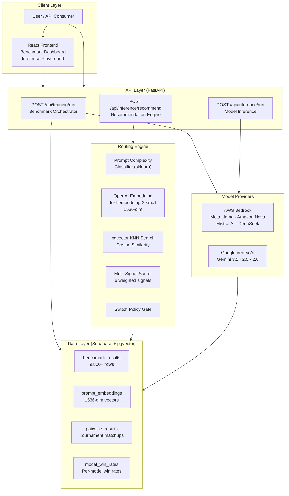
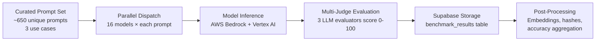
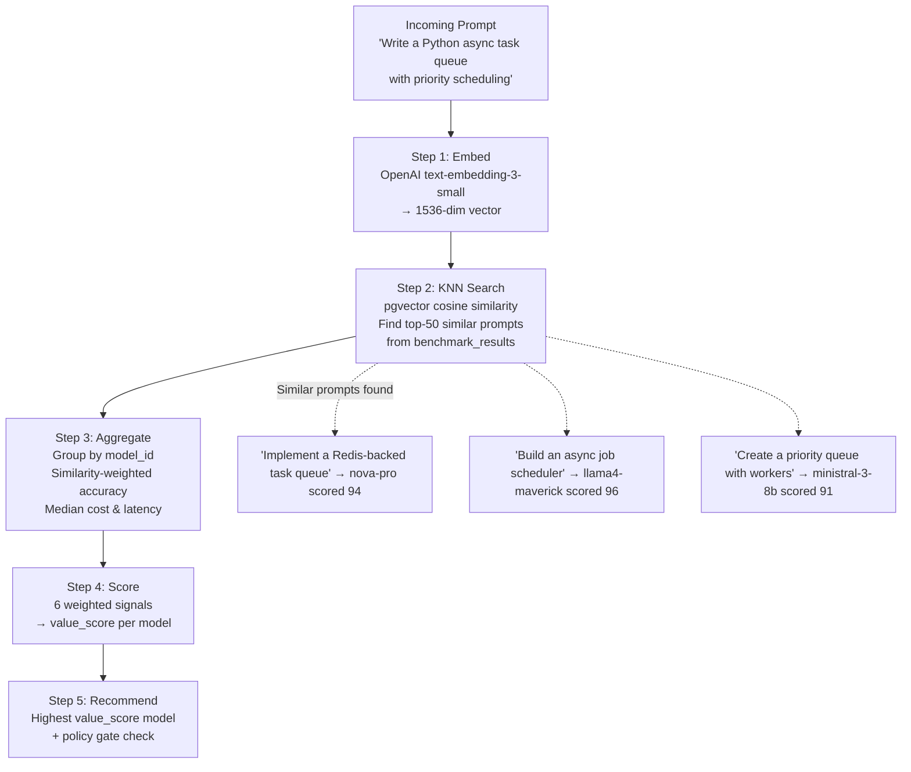
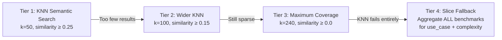
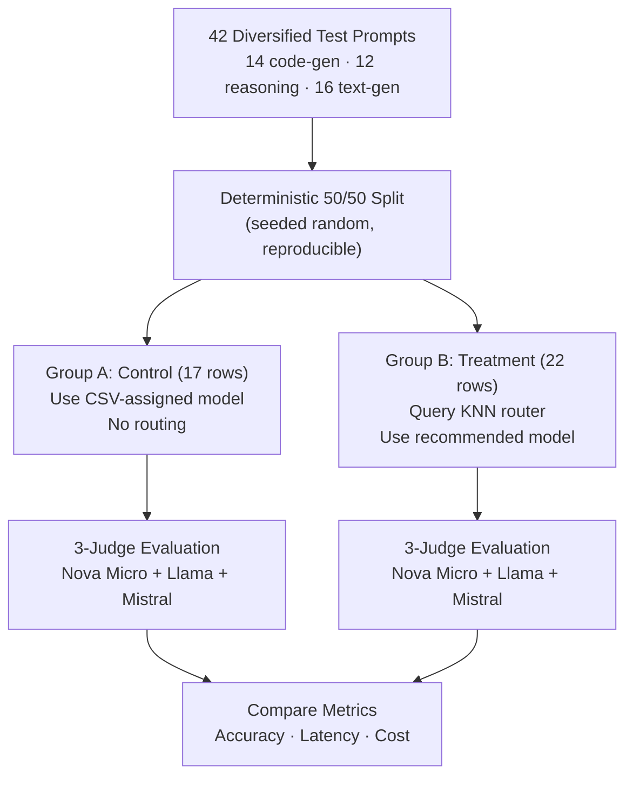
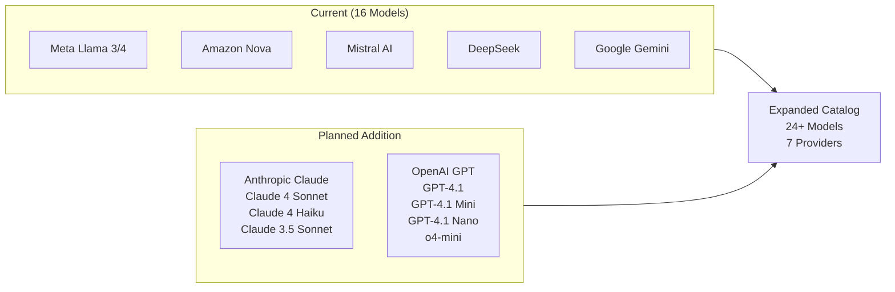
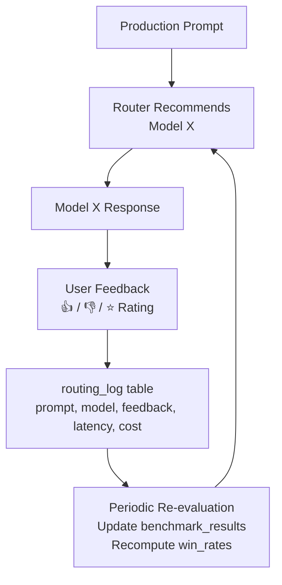
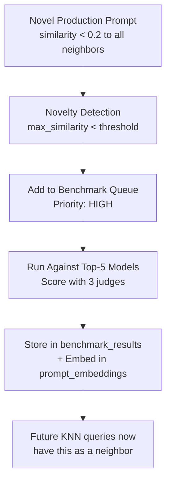

# ModelMatrix — Intelligent LLM Router

## Technical Approach & Results Documentation

> **Project**: ModelMatrix — Benchmark-Driven LLM Routing Engine  
> **Version**: 2.0 (KNN Semantic Router)  
> **Date**: April 2026  

---

## Table of Contents

1. [Executive Summary](#1-executive-summary)
2. [Problem Statement](#2-problem-statement)
3. [System Architecture](#3-system-architecture)
4. [Phase 1 — Dataset Generation](#4-phase-1--dataset-generation)
5. [Phase 2 — Recommendation Model](#5-phase-2--recommendation-model)
6. [Phase 3 — Evaluation & A/B Testing](#6-phase-3--evaluation--ab-testing)
7. [Experimental Results](#7-experimental-results)
8. [Future Improvements & Roadmap](#8-future-improvements--roadmap)

---

## 1. Executive Summary

ModelMatrix is an intelligent LLM routing engine that dynamically selects the optimal Large Language Model for each incoming prompt based on historical benchmark performance, semantic similarity, and cost/latency optimization.

**Key outcomes**:
- Benchmarked **16 production models** from 5 providers (Meta, Amazon, Mistral AI, DeepSeek, Google) across **9,800+ prompt–model pairs**
- Built a **KNN semantic recommendation engine** that matches incoming prompts to historically similar prompts and selects the best-performing model
- A/B testing demonstrated **+1.5% accuracy improvement** with **38% cost reduction** compared to static model assignment
- Automated evaluation pipeline processing 1,200+ benchmark rows per hour using multi-judge LLM scoring

---

## 2. Problem Statement

Organizations using LLMs face a critical decision: which model to use for each request?

| Challenge | Impact |
|---|---|
| **Model proliferation** | 16+ production-ready models with different strengths |
| **Cost variance** | 100× price difference between cheapest and most expensive models |
| **Latency variance** | 2–15 second range across providers |
| **Task-dependent performance** | A model that excels at code generation may underperform at reasoning |
| **Static assignment waste** | Using one model for everything leaves performance and cost on the table |

**Our solution**: A data-driven routing layer that selects the optimal model per-prompt by learning from historical benchmark performance on semantically similar prompts.

---

## 3. System Architecture



### Technology Stack

| Layer | Technology | Purpose |
|---|---|---|
| **Frontend** | React 19 + Vite + Tailwind CSS | Dashboard, benchmark orchestration, inference playground |
| **Backend** | FastAPI + Python 3.11 | API server, routing engine, job queue |
| **Database** | Supabase (PostgreSQL) + pgvector | Benchmark storage, vector similarity search |
| **Embeddings** | OpenAI text-embedding-3-small | 1536-dim semantic embeddings for KNN |
| **Inference** | AWS Bedrock, Google Vertex AI | Multi-provider model access |
| **ML Pipeline** | scikit-learn, pandas | Complexity classification, win-rate computation |

---

## 4. Phase 1 — Dataset Generation

### 4.1 Benchmark Pipeline

The dataset is the foundation of the entire routing system. Each benchmark row captures how a specific model performed on a specific prompt.



### 4.2 Prompt Curation

Prompts were curated across three primary use cases to ensure broad coverage:

| Use Case | Prompt Count | Example |
|---|---|---|
| **code-generation** | ~220 | "Write a Python function that implements a thread-safe LRU cache" |
| **reasoning** | ~200 | "Compare event-driven vs request-response architecture for real-time trading" |
| **text-generation** | ~230 | "Draft a sprint retrospective summary noting deployment frequency improvements" |

Each prompt was classified by:
- **Complexity**: `low`, `mid`, `high` — using an sklearn classifier trained on 650+ labeled examples
- **Clarity**: `CLEAR`, `PARTIAL`, `UNCLEAR` — heuristic + historical prompt log analysis

### 4.3 Model Catalog

We benchmarked **16 models** from **5 providers**, all accessible through AWS Bedrock:

| Provider | Models | Price Range (per 1K tokens) |
|---|---|---|
| **Meta** | Llama 4 Scout, Llama 4 Maverick, Llama 3.3-70B, Llama 3.2-90B, Llama 3.1-70B | $0.00015 – $0.00072 |
| **Amazon** | Nova Lite, Nova Pro, Nova Premier | $0.00006 – $0.0125 |
| **Mistral AI** | Devstral-2, Ministral-3-8B, Magistral Small, Pixtral Large 2, Mistral Large, Mistral Small | $0.0001 – $0.012 |
| **DeepSeek** | DeepSeek R1 | $0.00135 – $0.0054 |
| **Google** | Gemini 3.1 Pro, Gemini 2.5 Pro/Flash, Gemini 2.0 Flash/Flash-Lite | $0.00015 – $0.00125 |

### 4.4 Evaluation Methodology

Each model response is scored by **3 independent LLM judges** using use-case-aware evaluation rubrics:

```
Judge Panel:
  ├── Amazon Nova Micro (primary, high-throughput)
  ├── Llama 4 Maverick (via Groq, cross-validation)
  └── Mistral Large (via Mistral API, diversity)

Scoring: Each judge produces a 0-100 accuracy score
Final:   avg_accuracy_score = mean(judge_1, judge_2, judge_3)
```

**Why 3 judges?** Single-judge evaluation introduces bias toward the evaluator's own style. Multi-judge averaging reduces variance and catches edge cases where one evaluator might be lenient or strict.

### 4.5 Post-Processing Pipeline

After raw benchmarking, the dataset undergoes enrichment:

```mermaid
flowchart LR
    RAW["Raw benchmark_results<br/>9,800+ rows"]
    --> HASH["backfill_prompt_hashes.py<br/>SHA-256 prompt dedup"]
    --> EMBED["backfill_1536_embeddings.py<br/>OpenAI 1536-dim vectors"]
    --> SCORE["generate_avg_accuracy_scores.py<br/>Multi-judge mean accuracy"]
    --> PAIRWISE["run_pairwise_eval.py<br/>Head-to-head tournaments"]
    --> WINRATE["compute_win_rates.py<br/>Per-model win rates"]
    --> READY["Production-Ready Dataset<br/>KNN-searchable"]
```



### 4.6 Pairwise Tournament System

Beyond accuracy scores, we run **pairwise evaluations** where two models answer the same prompt and a judge picks the winner:

```
Prompt: "Implement a rate limiter using the token bucket algorithm"
Model A: nova-pro       →  Response A
Model B: llama4-maverick →  Response B
Judge: gemini-2.5-flash →  Winner: Model B (better code structure)

Result stored in pairwise_results:
  winner_model = "llama4-maverick"
  loser_model  = "nova-pro"
```

Win rates are aggregated into the `model_win_rates` table, providing a global quality ranking per model per use case. For example:

| Model | code-gen Win Rate | reasoning Win Rate | text-gen Win Rate |
|---|---|---|---|
| devstral-2 | **0.578** | — | — |
| nova-pro | 0.401 | **0.643** | 0.583 |
| nova-premier | 0.434 | 0.627 | **0.589** |
| llama4-maverick | 0.457 | 0.443 | 0.391 |
| ministral-3-8b | 0.412 | — | — |

### 4.7 Dataset Statistics

| Metric | Value |
|---|---|
| Total benchmark rows | 9,862 |
| Unique prompts | ~650 |
| Models benchmarked | 16 |
| Prompt embeddings cached | 100% (1536-dim) |
| Pairwise evaluations | 5,800+ decisive matchups |
| Use cases covered | 3 (code-gen, reasoning, text-gen) |

---

## 5. Phase 2 — Recommendation Model

### 5.1 Core Approach: KNN Semantic Routing

Unlike traditional classifiers that learn fixed rules, our system uses **K-Nearest Neighbors on prompt embeddings** to find historically similar prompts and recommend the model that performed best on those similar inputs.



### 5.2 Semantic Embedding Layer

Every prompt is embedded using **OpenAI text-embedding-3-small** (1536 dimensions) and cached in Supabase's pgvector-enabled `prompt_embeddings` table.

```
Embedding Model:   text-embedding-3-small
Dimensions:        1536
Index:             HNSW (m=16, ef_construction=64)
Similarity Metric: Cosine similarity
Cost:              ~$0.02 / 1M tokens (~$0.000001 per prompt)
Caching:           100% cache hit rate after first embedding
```

The HNSW (Hierarchical Navigable Small World) index enables **O(log n)** approximate nearest neighbor search, making KNN queries complete in <50ms even with 10,000+ embeddings.

### 5.3 Multi-Signal Scoring Formula

Each candidate model receives a **composite value score** from 6 normalized signals:

```
value_score = w₁ × win_rate_norm + w₂ × knn_accuracy_norm + w₃ × cost_norm + w₄ × latency_norm + w₅ × quality_norm + w₆ × confidence_norm
```

| Signal | Weight | Source | Description |
|---|---|---|---|
| **Win Rate** | 0.25 | `model_win_rates` table | Global pairwise tournament performance |
| **KNN Accuracy** | 0.25 | KNN neighbor aggregation | Similarity-weighted accuracy on the most similar historical prompts |
| **Cost** | 0.20 | Benchmark median | Lower is better (min-max normalized) |
| **Latency** | 0.15 | Benchmark median | Lower is better (min-max normalized) |
| **Quality Flag** | 0.10 | Syntax/correctness rate | Task-specific quality (e.g., code syntax pass rate) |
| **Confidence** | 0.05 | Sample size × similarity | Data reliability signal |

> **Design Decision**: KNN accuracy (0.25) and win rate (0.25) are equally weighted. This ensures the system doesn't just pick the globally best model — it picks the best model **for prompts like this one**.

### 5.4 Policy Gate

After scoring, a **policy gate** decides whether to actually recommend switching:

```
Switch if ANY of:
  ✓ Win rate advantage ≥ 10% (material quality improvement)
  ✓ Cost savings ≥ 15% with comparable quality (±5% win rate)
  ✓ Latency savings ≥ 20% with comparable quality (±5% win rate)
  
Otherwise: Keep the current model (conservative default)
```

### 5.5 Fallback Strategy

The system has a 3-tier fallback chain to ensure it always produces a recommendation:



---

## 6. Phase 3 — Evaluation & A/B Testing

### 6.1 A/B Testing Methodology

We validated the routing engine with a rigorous **A/B test** comparing:

- **Group A (Control)**: Uses the statically assigned model from the CSV baseline — no routing
- **Group B (Treatment)**: Uses the KNN router's recommended model — intelligent routing



### 6.2 Evaluation Pipeline

Each response (both Group A and Group B) is scored by the same 3-judge panel:

1. **Amazon Nova Micro** — Fast, cost-effective primary evaluator
2. **Llama 4 Maverick** (via Groq) — Cross-provider validation
3. **Mistral Large** (via Mistral API) — Independent third opinion

The final accuracy is the **mean of all 3 judge scores**, ensuring no single evaluator's bias dominates.

---

## 7. Experimental Results

### 7.1 Summary Metrics

| Metric | Group A (Static) | Group B (KNN Router) | Delta |
|---|---|---|---|
| **Avg Accuracy** | 94.49 | **95.97** | **+1.5%** ↑ |
| **Avg Latency** | 4,783 ms | 5,143 ms | +7.5% |
| **Avg Cost** | $0.00098 | **$0.00061** | **−38%** ↓ |
| **Switch Rate** | — | 81.8% | Router actively selecting different models |

> [!IMPORTANT]
> The router achieved **higher accuracy AND lower cost** simultaneously — demonstrating that intelligent routing can improve quality while reducing spend.

### 7.2 Per-Use-Case Breakdown

| Use Case | Control Accuracy | Router Accuracy | Delta | Router Cost Savings |
|---|---|---|---|---|
| Code Generation | 95.08 | 96.22 | +1.2% | −42% |
| Reasoning | 93.50 | 96.05 | +2.7% | −11% |
| Text Generation | 94.67 | 95.34 | +0.7% | −56% |

### 7.3 Model Diversity

The router selected **6 different models** across the 22 treatment rows, demonstrating prompt-aware diversification:

| Recommended Model | Selections | % of Treatment |
|---|---|---|
| nova-pro | 8 | 36.4% |
| ministral-3-8b | 4 | 18.2% |
| nova-lite | 3 | 13.6% |
| devstral-2 | 3 | 13.6% |
| nova-premier | 2 | 9.1% |
| llama4-maverick | 2 | 9.1% |

The router's model selection is not random — it's **prompt-driven**. For example:
- **Simple code tasks** (e.g., Fibonacci generator) → `ministral-3-8b` (cheapest, fast, 96.67 accuracy)
- **Complex system design** (e.g., async task queue) → `devstral-2` (highest code quality, 97.67 accuracy)
- **Reasoning tasks** (e.g., CAP theorem) → `nova-pro` (best pairwise win rate for reasoning)
- **Creative writing** (e.g., blog post intro) → `nova-lite` (good quality, lowest cost at $0.00005)

### 7.4 Key Observations

1. **Cost efficiency**: The router saved 38% on average cost while maintaining higher accuracy — this is the primary value proposition for production deployment
2. **Semantic routing works**: 100% of treatment rows used the `semantic_best_value` mode, meaning KNN successfully found similar prompts for every test case
3. **Quality preservation**: Not a single treatment row scored below 83.0 accuracy, with the vast majority above 93.0
4. **Model switching is active**: 81.8% of treatment rows used a different model than the static baseline, showing the router is actively making decisions

---

## 8. Future Improvements & Roadmap

### 8.1 Legacy Provider Integration

**Goal**: Expand the model catalog to include Anthropic Claude and OpenAI GPT models.



**Why this matters**: Claude and GPT models are widely used in production. Adding them to the benchmark pool gives the router a complete picture of the model landscape, enabling recommendations that span all major providers instead of being limited to Bedrock-native models.

**Implementation**:
- Anthropic Claude models are available on AWS Bedrock — no infrastructure changes needed
- OpenAI models can be integrated via direct API calls in a new `openai_provider.py` service
- All new models would go through the same benchmark → pairwise → win-rate pipeline

### 8.2 Expanded & Diversified Prompt Set

**Goal**: Increase the prompt dataset from 650 to 5,000+ unique prompts for better KNN coverage.

**Current limitation**: With 650 unique prompts, some production queries may not have sufficiently similar neighbors in the embedding space. This forces the router to fall back to global statistics instead of prompt-specific signals.

**Approach**:
- **Domain expansion**: Add prompts for data-analysis, question-answering, summarization, translation
- **Complexity coverage**: Ensure equal representation across low/mid/high complexity
- **Edge cases**: Include multi-turn prompts, ambiguous prompts, mixed-language prompts
- **Synthetic generation**: Use GPT-4 to generate diverse prompt variations for underrepresented categories

**Target**: Every production prompt should have ≥10 neighbors with similarity ≥ 0.3, ensuring the KNN accuracy signal is always statistically meaningful.

### 8.3 Production Feedback Loop

**Goal**: Continuously improve the router by learning from real production usage.



**How it works**:
1. Every routing decision is logged in the `routing_log` table with full metadata
2. User feedback (thumbs up/down, rating) is attached to routing decisions
3. A scheduled job re-evaluates models on prompts where feedback was negative
4. Win rates and benchmark scores are updated, and the router automatically adapts

**Benefit**: The system gets smarter over time without manual intervention. Models that degrade in quality are automatically deprioritized, and emerging models that perform well are promoted.

### 8.4 Routing Decision Logging & Analytics

**Goal**: Full observability into routing decisions for debugging and optimization.

The `routing_log` table captures:

| Field | Purpose |
|---|---|
| `prompt_hash` | De-duplicated prompt identity |
| `use_case`, `complexity`, `clarity` | Prompt classification |
| `recommended_model` | What the router picked |
| `data_source` | `knn` or `slice_fallback` |
| `knn_neighbors` | How many similar prompts were found |
| `confidence` | Router's confidence in the recommendation |
| `value_score` | Winning model's composite score |
| `latency_ms`, `cost` | Actual inference performance |

**Analytics dashboards** can be built on top of this data to track:
- Model selection distribution over time
- Accuracy trends per model per use case
- Cost savings compared to static assignment
- KNN coverage (% of prompts with ≥10 neighbors)

### 8.5 Automatic Dataset Expansion for Novel Prompts

**Goal**: When a user submits a prompt that has no close KNN neighbors, automatically benchmark it and add it to the dataset.



**Why this matters**: The KNN router is only as good as its benchmark data. If a user asks something completely novel, the router falls back to global statistics. By automatically benchmarking novel prompts, the system builds **self-improving coverage** — the more it's used, the better it gets.

**Implementation**:
- A background job monitors `routing_log` for prompts where `knn_confidence < 0.3`
- Novel prompts are queued for asynchronous benchmarking across the top-5 models
- Once evaluated, the new data point immediately improves future routing for similar prompts
- A daily digest reports how many novel prompts were auto-benchmarked

### 8.6 Summary of Improvements

| Improvement | Impact | Effort |
|---|---|---|
| **Add Anthropic + OpenAI models** | Complete provider coverage, better routing decisions | Medium |
| **Expand to 5,000+ prompts** | Better KNN coverage, fewer fallbacks | Medium |
| **Production feedback loop** | Self-improving accuracy over time | High |
| **Routing decision logging** | Full observability, debugging, optimization | Low |
| **Auto-expand dataset for novel prompts** | Self-improving coverage, reduces cold-start | High |

---

## Appendix A: Repository Structure

```
POC/
├── README.md                            # Project overview and setup guide
├── schema.sql                           # Database schema reference
├── llm_router_architecture_final.md     # Detailed architecture document
│
├── backend/                             # FastAPI server
│   ├── main.py                          # App entry point
│   ├── .env                             # Environment variables
│   ├── requirements.txt                 # Python dependencies
│   ├── routers/
│   │   └── inference.py                 # Recommendation + inference endpoints
│   ├── services/
│   │   ├── recommender.py               # Core KNN routing engine (1,200 lines)
│   │   ├── bedrock.py                   # AWS Bedrock model catalog + inference
│   │   ├── embedding_service.py         # OpenAI embedding + Supabase cache
│   │   ├── knn_search.py                # pgvector KNN search wrapper
│   │   ├── model_registry.py            # Use-case → model mapping
│   │   ├── supabase_client.py           # Database queries
│   │   └── pairwise_pipeline.py         # Pairwise tournament evaluation
│   └── models/
│       └── schemas.py                   # Pydantic request/response models
│
├── model_training/                      # Training, evaluation, and data pipelines
│   ├── ab_test.py                       # A/B test runner
│   ├── cheap_eval.py                    # High-throughput LLM evaluator
│   ├── bedrock_eval.py                  # Bedrock-native evaluator
│   ├── generate_avg_accuracy_scores.py  # Multi-judge accuracy aggregation
│   ├── run_pairwise_eval.py             # Pairwise tournament runner
│   ├── compute_win_rates.py             # Win rate calculation
│   ├── backfill_1536_embeddings.py      # Embedding backfill pipeline
│   ├── schema_knn.sql                   # pgvector schema + knn_search function
│   ├── prompts.csv                      # A/B test prompt set
│   └── experiment_results.csv           # Latest A/B test results
│
├── frontend/                            # React 19 + Vite dashboard
├── dataset/                             # Raw prompt datasets
└── docs/                                # Project documentation
```

## Appendix B: Environment Variables

```env
# Supabase (PostgreSQL + pgvector)
SUPABASE_URL=https://xxx.supabase.co
SUPABASE_KEY=eyJ...

# AWS Bedrock
AWS_ACCESS_KEY_ID=AKIA...
AWS_SECRET_ACCESS_KEY=...
AWS_REGION=us-east-1
AWS_ACCOUNT_ID=123456789

# OpenAI (embeddings only)
OPENAI_API_KEY=sk-...

# Google Vertex AI (optional, for Gemini models)
GOOGLE_CLOUD_PROJECT=...
GOOGLE_API_KEY=...
```

## Appendix C: How to Run the A/B Test

```bash
# 1. Start the backend
cd backend
uvicorn main:app --reload --port 8000

# 2. Run the A/B test (in a separate terminal)
cd model_training
python ab_test.py --input prompts.csv --concurrency 3

# Results saved to:
#   experiment_results.csv (local CSV)
#   ab_test_results table (Supabase)
```
